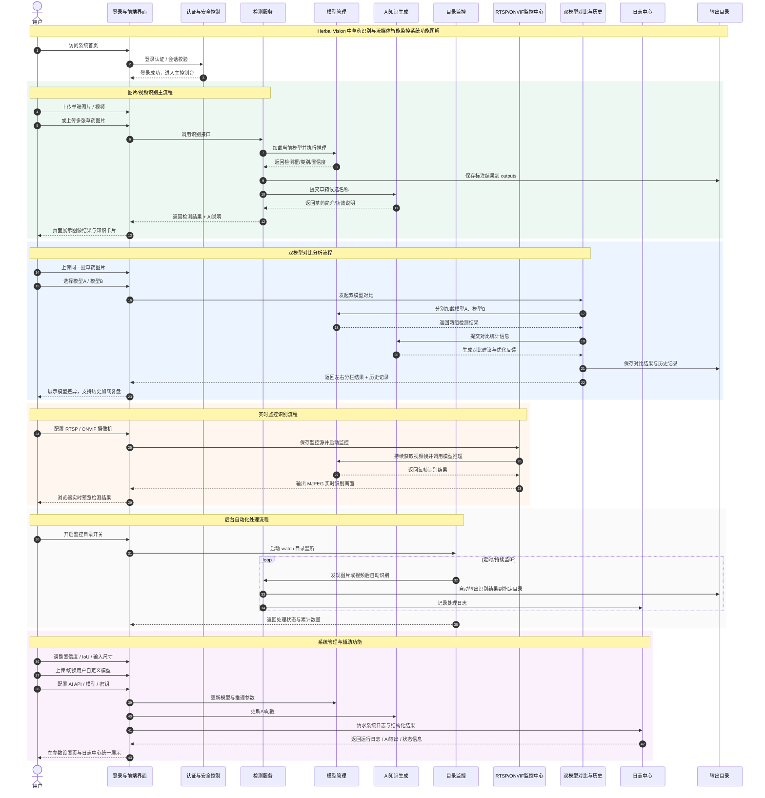

# Herbal Vision 功能图解

以下图解采用 Mermaid 时序图形式，风格上参考你给出的“功能图解/媒体同步”展示方式，适合直接截图放入论文，或继续在支持 Mermaid 的编辑器中微调。

## 论文配套说明文字

该功能图解反映了系统从“用户访问—身份认证—识别执行—AI补充—结果展示—后台监控—日志回溯”的完整工作链路。系统以前端控制台为统一交互入口，在用户登录成功后，可分别进入图片/视频识别、双模型对比、实时监控、参数设置和日志中心等模块。识别主流程中，系统调用当前模型完成目标检测，并将识别结果保存至输出目录，同时结合 AI 服务生成草药简介与功效说明。对于研究场景，系统还支持双模型对比和历史记录保存，便于研究者复盘分析；对于工程应用场景，系统则支持监控目录自动识别与 RTSP/ONVIF 实时监控接入，体现出一定的自动化处理能力与工程化集成能力。

## 使用建议

- 如果你要放进论文正文，可以直接截图 Mermaid 渲染结果。
- 如果你要我继续帮你做成“更像你发的那张图”的深色版 SVG/HTML 图，我下一步可以直接给你生成可导出图片的静态页面文件。
